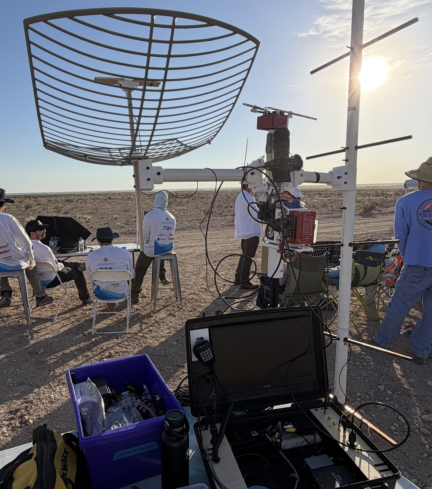
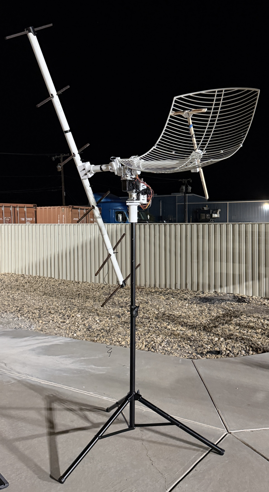
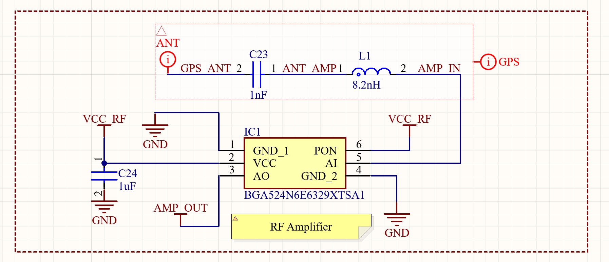
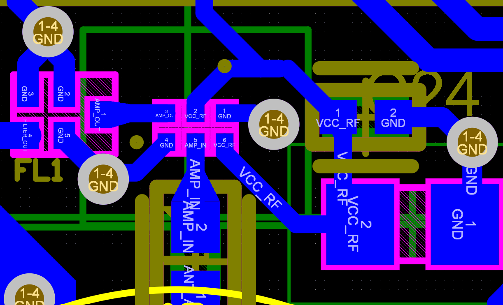
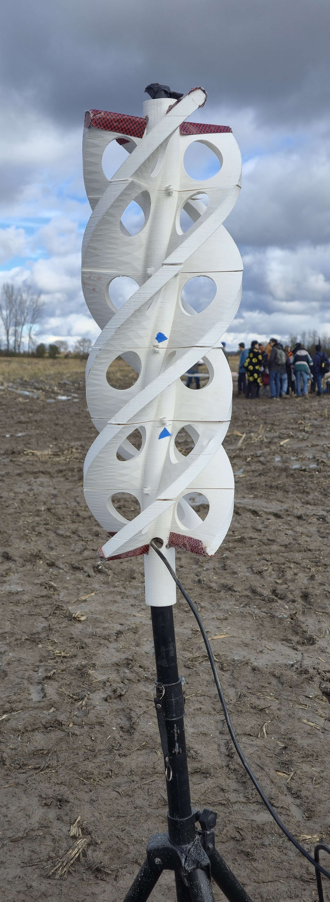
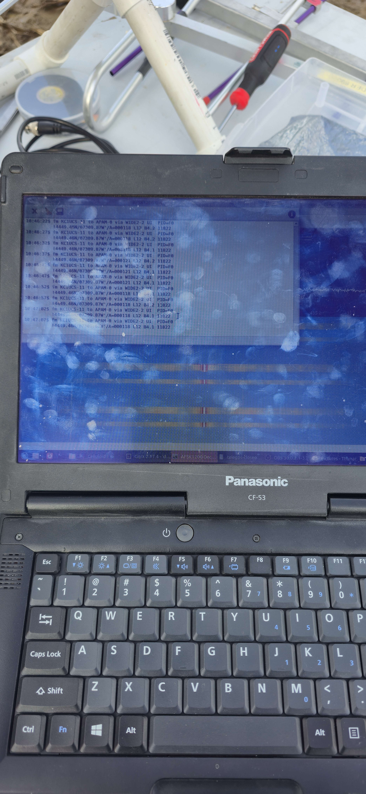
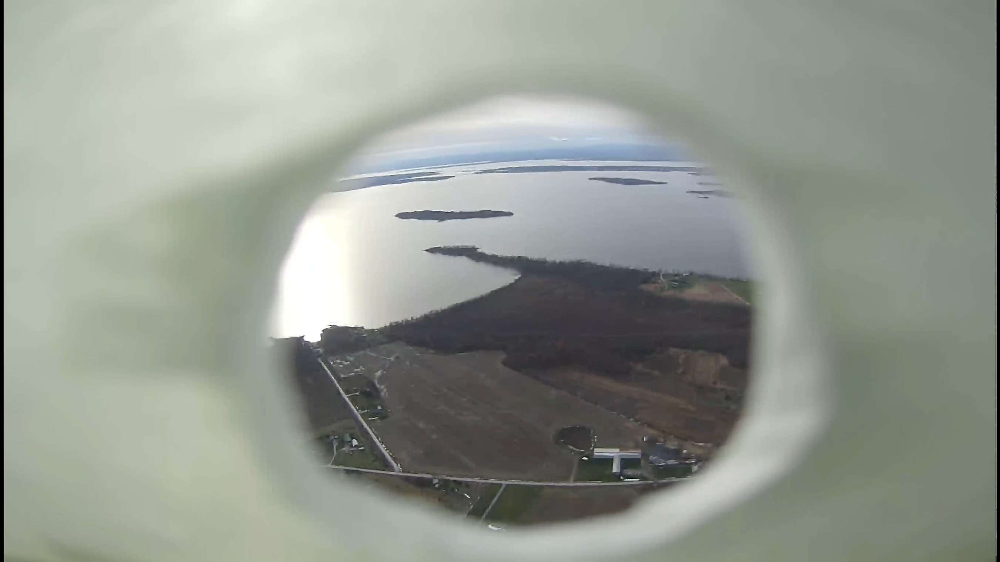
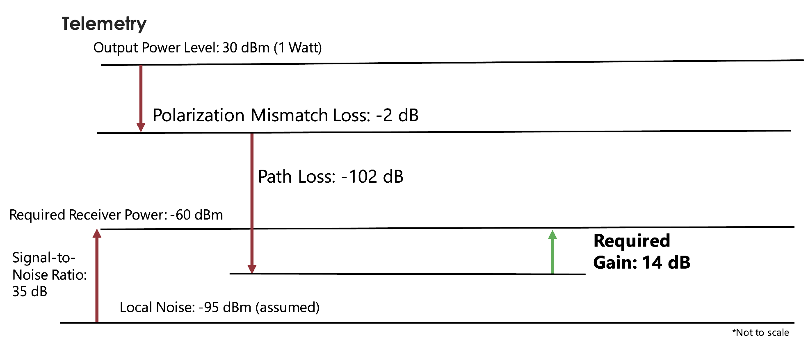

# Integrated Ground Station Communications System

## Project Overview

This project is part of the Electronics and Programming (EnP) division of the Worcester Polytechnic Institute High Power Rocketry Club.

I joined Ground Station in August 2025 and worked on ground-station hardware, electronics, RF/video testing, field deployment, and support for a motorized antenna-tracking system. I also contributed to HPRC electronics work through PCB assembly, rework, wiring-harness fabrication, and Altium-based board modifications.

For the 2026–2027 competition cycle, I became **Ground Station Lead** and began developing the architecture for the next-generation communications system.

The current goal is to create a ground station capable of receiving both live video and rocket telemetry through an integrated RF link while also supporting antenna tracking, field deployment, and future higher-altitude missions.

**Organization:** WPI High Power Rocketry Club  
**Division:** Electronics and Programming (EnP)  
**Role:** Ground Station Lead / Electronics Member  
**Project Dates:** August 2025 – Present  
**Competition:** 2027 International Rocket Engineering Competition

<p align="center">
  
</p>

<p align="center"><em>Ground Station hardware deployed during launch operations.</em></p>

---

## Ground Station Responsibilities

The Ground Station subsystem is responsible for receiving and displaying data transmitted from the rocket during flight.

Major responsibilities include:

- Rocket telemetry reception
- Live-video reception
- RF link planning
- Ground-side radio hardware
- Antenna selection and testing
- Antenna tracking
- Field deployment and setup
- Operator interfaces and data presentation

Because the rocket may travel tens of thousands of feet from the launch site, communications reliability, antenna performance, system setup time, and RF link margin are all important design considerations.

---

# 2025–2026 Ground Station Work

## Motorized Antenna Tracker

During my first year on Ground Station, I assisted with the development and testing of a motorized antenna-tracking system.

The tracker used two motorized axes to control azimuth and elevation, allowing directional antennas to follow the rocket during flight.

My role was primarily supporting the tracker effort through assembly, testing, troubleshooting, and design-review preparation rather than serving as the primary designer.

<p align="center">
  
</p>

<p align="center"><em>Motorized azimuth/elevation antenna tracker used for directional ground antennas.</em></p>

I also helped present Ground Station work during the team's Preliminary Design Review and Critical Design Review.

---

## Flight Electronics Assembly

One of my major electronics projects was helping assemble and troubleshoot a custom 50 mm × 50 mm MARS flight electronics board.

This was my first substantial experience with surface-mount electronics assembly.

My work included:

- SMD resistor and sensor placement
- Heat-gun reflow
- Fine-pitch component placement
- Board rework
- Continuity and connection troubleshooting
- Power-rail debugging
- Replacing and resoldering failed components

I worked with another electronics member to assemble the front side of the board and later populated the back side independently.

<p align="center">
  
</p>

<p align="center"><em>3D rendering of the MARS flight-electronics PCB.</em></p>

One particularly difficult component was a very small BGA123 sensor package. After working with the component during assembly, I began looking for a larger alternative that would be easier to integrate and manufacture.

---

## Altium PCB Work

As I became more comfortable with electronics, I began learning **Altium Designer** and contributing directly to the PCB design files.

For an alternate sensor, I created:

- Schematic symbol
- PCB footprint
- 3D model integration
- Initial placement and routing work

The design was later refined by another electronics member, but this was my first experience taking a component from datasheet-level information into an actual PCB library and board design.

<p align="center">
  
  
</p>

<p align="center">
  <em>Custom sensor schematic/footprint work and corresponding PCB integration.</em>
</p>

---

## Wiring Harness Fabrication

I also supported the payload electronics team by fabricating wiring harnesses.

This involved crimping and assembling a large number of approximately 30 AWG connections for payload electronics.

The work gave me hands-on experience with:

- Fine-gauge wire handling
- Connector crimping
- Harness assembly
- Continuity checking
- Cable organization

---

## Telemetry and Live-Video Testing

Ground Station used separate systems for telemetry and live video during the 2025–2026 cycle.

I helped test the live-video receiving setup, including the directional ground antenna and video receiver.

During one test launch, no other Ground Station members were available, so I independently transported, assembled, and operated the full Ground Station system.

I successfully established:

- **222 MHz telemetry reception**
- **1.3 GHz live-video reception**

<p align="center">
  
</p>

<p align="center"><em>Ground antenna deployed during a test launch.</em></p>

<p align="center">
  
</p>

<p align="center"><em>Ground-station laptop receiving live GPS and telemetry data.</em></p>

<p align="center">
  
</p>

<p align="center"><em>Frame from the 1.3 GHz live-video feed received from the rocket during flight.</em></p>

This was one of the first times I operated the complete system independently in a real launch environment.

---

# 2026–2027 Ground Station Development

## Design Goals

For the 2026–2027 cycle, I began redesigning the communications architecture around several goals:

- Combine live video and telemetry into a more integrated system
- Reduce the number of independent RF links
- Improve system modularity
- Design for future higher-altitude launches
- Improve Ground Station setup and operator workflow
- Increase Ground Station documentation and subsystem continuity

The current flight target is approximately 30,000 ft, but the communications system is being designed around a **50,000–60,000 ft range requirement** so the system will not need to be redesigned for future higher-altitude missions.

---

## Current Communications Architecture

The current concept uses a **2.4 GHz Semtech LR2021-based radio architecture**.

The LR2021 supports both LoRa and FLRC modulation modes, with FLRC providing substantially higher data throughput than conventional LoRa modulation.

The current architecture under evaluation is:

```text
RunCam WiFiLink 2
        |
        | Ethernet
        v
Small Single-Board Computer
        |
        | Extract / process H.265 video
        | Combine video + telemetry
        v
      LR2021
        |
        | 2.4 GHz FLRC RF Link
        v
Ground Station Receiver
        |
        +--> Live Video
        |
        +--> Rocket Telemetry
```

The goal is to combine compressed H.265 video and rocket telemetry into a single RF link.

This architecture is still in development and may change as testing progresses.

---

## Video Architecture

The current video source under consideration is the **RunCam WiFiLink 2**.

The camera outputs compressed H.265 video over Ethernet.

Rather than transmitting the entire network stream directly, the plan is to use a small single-board computer to extract the encoded video stream and prepare it for transmission alongside rocket telemetry.

This approach is intended to reduce unnecessary protocol overhead and make more efficient use of the available radio bandwidth.

---

## Telemetry Integration

Rocket telemetry will originate from the MARS flight electronics system.

The Ground Station architecture is being designed so that telemetry data can be multiplexed with the encoded video stream before transmission.

The long-term goal is for the ground-side receiver to separate the two data streams and provide:

- Live video display
- Rocket position
- GPS data
- Flight telemetry
- Ground Station status

---

## RF Link Analysis

A major part of the current design process is developing the RF link budget.

The link budget considers:

- Transmit power
- Receiver sensitivity
- Antenna gain
- Feed-line losses
- Free-space path loss
- Required data rate
- Modulation mode
- Link margin
- Rocket orientation
- Ground antenna characteristics

The system is being analyzed for a design range of approximately **50,000–60,000 ft**.

<p align="center">
  
</p>

<p align="center">
  <em>Example telemetry link-budget analysis from the 2025–2026 Ground Station system.</em>
</p>

I am also studying antenna behavior and selection for both the rocket and ground systems.

Future analysis will include more detailed antenna simulation and radiation-pattern evaluation.

---

## Antenna Development

Antenna design is an increasingly important part of the Ground Station work.

Current areas of study include:

- Rocket-mounted antennas
- Ground directional antennas
- Antenna gain
- Polarization
- Radiation patterns
- Feed-line loss
- Tracking requirements

I am continuing to expand my knowledge of antenna analysis and RF propagation to support the new communications architecture.

---

## PCB Development

The new radio system will require substantial custom PCB development.

I completed most of HPRC's internal Altium training material and am preparing to contribute heavily to the radio-board design.

Likely PCB responsibilities include:

- LR2021 integration
- RF signal routing
- Power regulation
- Connectors and interfaces
- SBC/radio interconnects
- Telemetry interfaces
- Ground-side radio hardware

This work is currently in the design phase.

---

## PCB Design Workshop

In September 2026, I co-taught an introductory **PCB design workshop** for HPRC members alongside two other electronics members.

The workshop introduced members to the basic PCB-design workflow, including:

- Schematic capture
- Component libraries
- Footprints
- Board layout
- Routing

This was my first experience teaching PCB design to a larger technical group.

---

## Ground Station Leadership

As Ground Station Lead, my responsibilities now extend beyond individual technical tasks.

I coordinate work involving:

- RF communications
- Antenna development
- Electronics
- Ground-side radio hardware
- Antenna tracking
- Design reviews
- Documentation
- Subsystem planning

I began participating in ENP lead meetings during the summer before the academic year and developed an initial workflow for the 2026–2027 Ground Station effort.

At the first Ground Station meeting of the year, I presented a roughly 30-page technical overview covering the previous system, lessons learned, competition constraints, and the planned direction for the new communications architecture.

---

## Design Constraints

The Ground Station system must balance several competing requirements.

### Range

The link must remain reliable over tens of thousands of feet.

### Bandwidth

Live video requires substantially more throughput than conventional telemetry.

### Antenna Size

Rocket-side antenna size and mounting options are limited.

### Rocket Orientation

The rocket can rotate and change orientation rapidly during flight.

### Ground Tracking

Directional ground antennas can increase range but may require accurate antenna tracking.

### Regulatory Constraints

The system must operate within frequency and bandwidth limits appropriate for the competition and licensed radio operation.

### Reliability

The Ground Station must be deployable in the field and operate reliably under time pressure.

---

## Current Status

As of September 2026:

- Ground Station architecture has been defined at a high level
- LR2021 is being evaluated as the primary RF device
- Link-budget analysis is underway
- Video and telemetry multiplexing architecture is being investigated
- PCB design preparation is underway
- Antenna options are being studied
- Ground Station team organization and documentation have begun

The communications architecture is still evolving, and several design choices may change after hardware testing.

---

## Future Work

Major upcoming milestones include:

- Finalizing the radio architecture
- Designing the LR2021 radio PCB
- Testing LR2021 throughput and range
- Integrating telemetry and video streams
- Developing the ground-side receiver
- Selecting and testing antennas
- Performing full link-budget validation
- Integrating the antenna tracker
- Conducting ground-range testing
- Performing flight testing
- Deploying the final system at the 2027 International Rocket Engineering Competition

---

## My Contributions

### 2025–2026

- Assisted with motorized antenna tracker development and testing
- Presented Ground Station work during PDR/CDR
- Assembled and reworked MARS flight electronics
- Performed SMD soldering and PCB debugging
- Populated one side of a MARS PCB independently
- Fabricated payload wiring harnesses
- Created an alternate sensor schematic symbol, footprint, and 3D model in Altium
- Assisted with live-video testing
- Independently deployed telemetry and video Ground Station hardware during a test launch

### 2026–2027

- Became Ground Station Lead
- Developed the initial communications-system architecture
- Evaluated the LR2021 for integrated video and telemetry
- Began RF link-budget and antenna analysis
- Planned the 50,000–60,000 ft communications design requirement
- Coordinated Ground Station technical meetings and design reviews
- Co-taught an introductory PCB design workshop
- Prepared for radio-board PCB development
- Coordinated RF, antenna, electronics, and tracking development

---

## Engineering Takeaways

HPRC has been one of my most important experiences for learning how complex engineering systems evolve over multiple years.

During my first year, I gained hands-on experience with electronics assembly, PCB rework, wiring, RF systems, and field deployment. I also learned how subsystem work is presented and evaluated through formal Preliminary and Critical Design Reviews.

Becoming Ground Station Lead changed the scale of the work. Instead of focusing only on individual hardware tasks, I now have to think about the complete communications architecture, interfaces between subsystems, technical risk, regulatory constraints, documentation, and how work is divided across a team.

The current radio project has also pushed me further into RF engineering. Designing a communications system for tens of thousands of feet requires thinking about more than simply selecting a radio module. Bandwidth, modulation, antenna gain, receiver sensitivity, polarization, propagation loss, PCB layout, and mechanical integration all affect whether the system will work.

Most importantly, the project is teaching me how to make engineering decisions while the design is still uncertain. The LR2021 architecture is promising, but it has not yet been proven in flight. The goal is to progressively validate the architecture through analysis, bench testing, range testing, and eventually flight testing.
