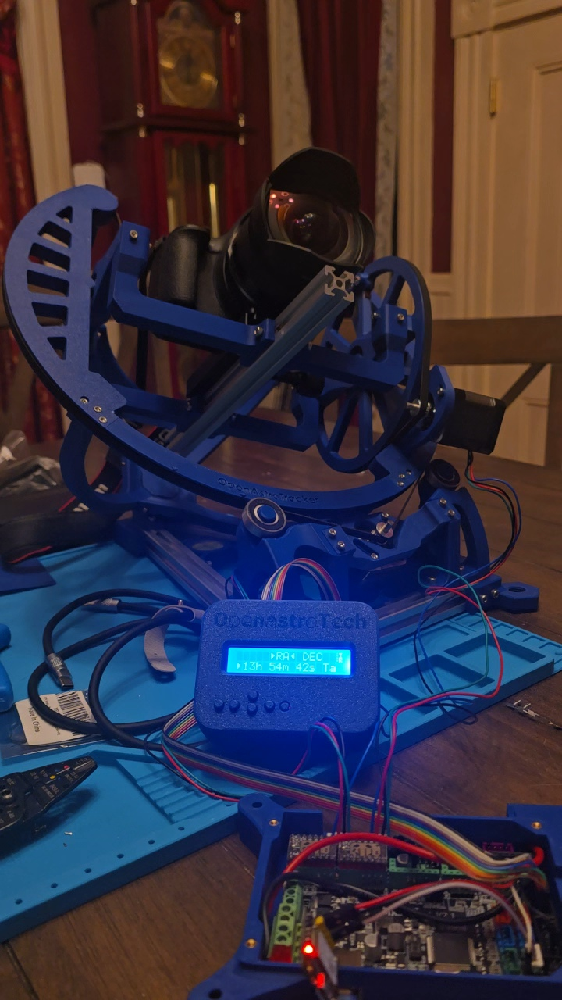
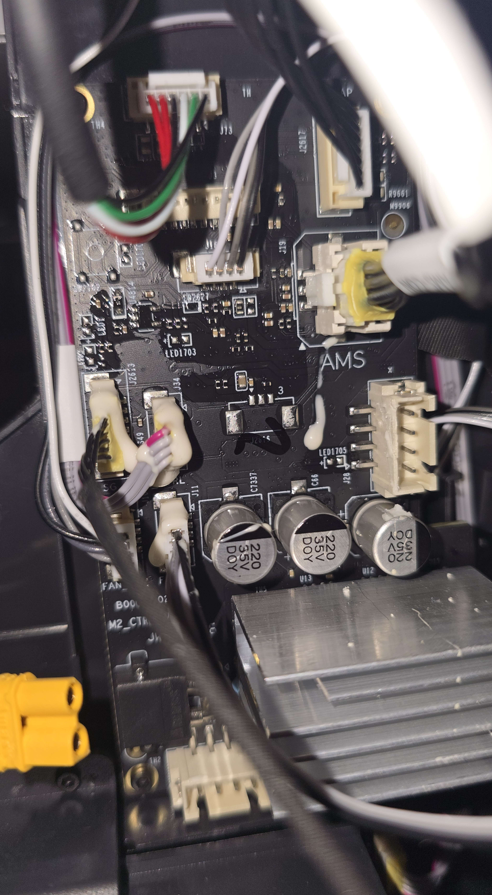
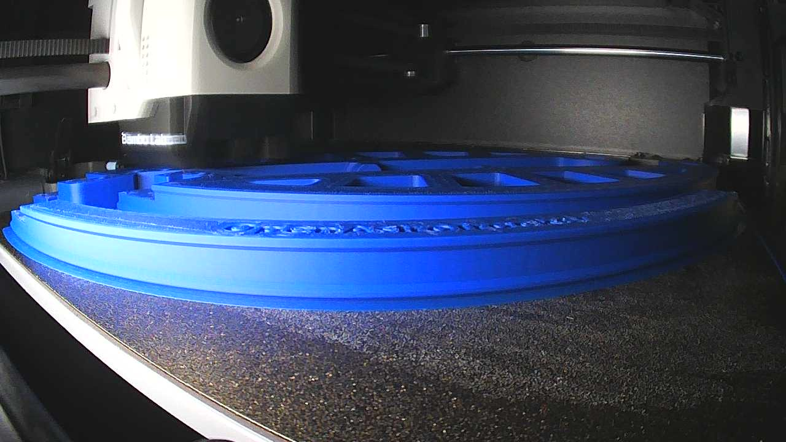
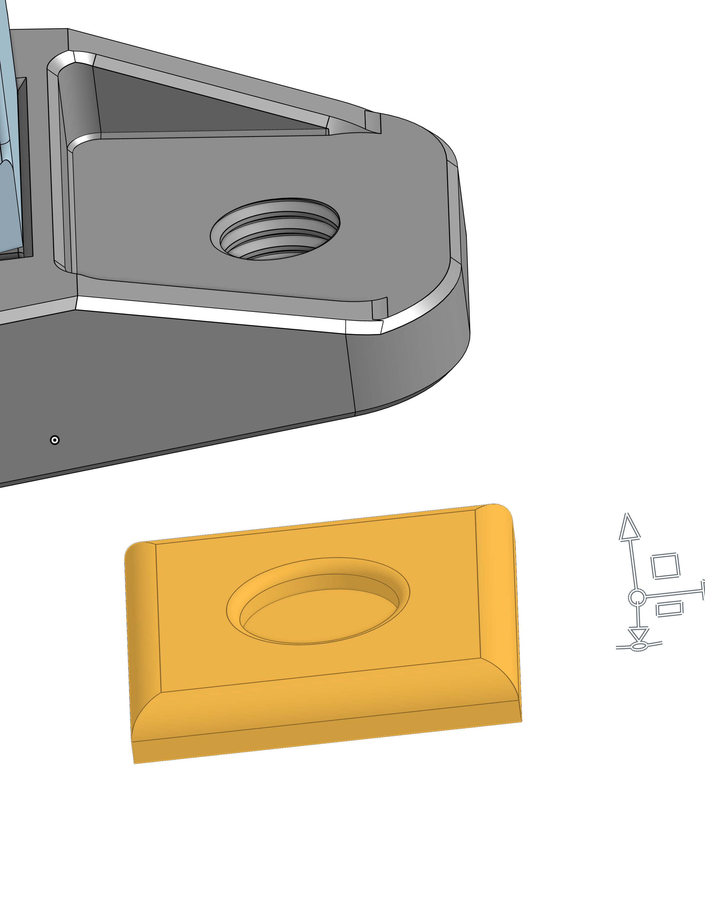
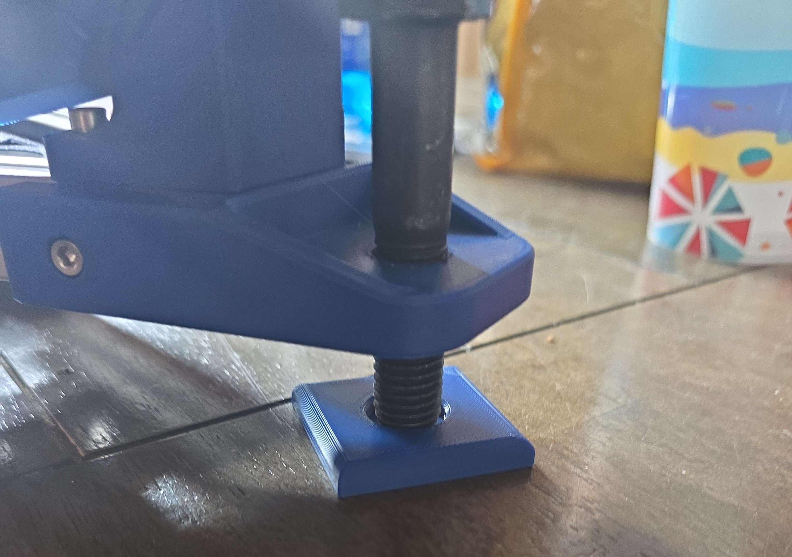
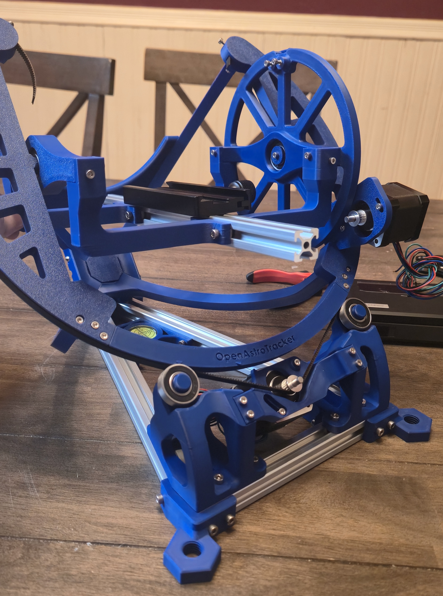
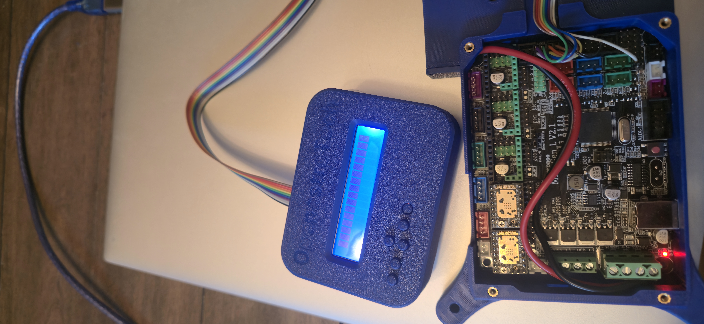
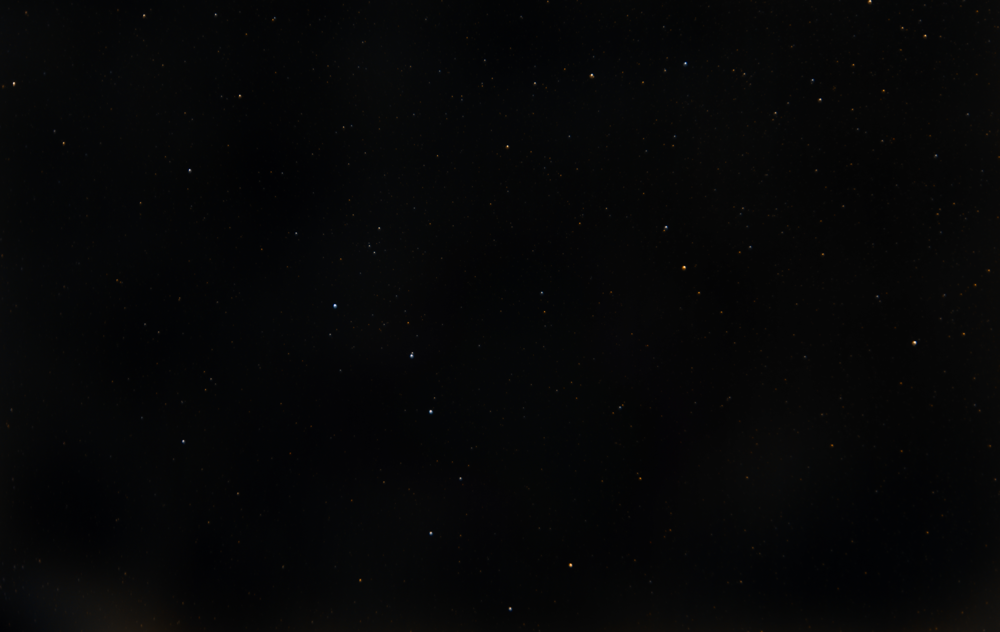

# Motorized Equatorial Camera Tracker

## Project Overview

This project is a personal astrophotography and mechatronics build based on the open-source OpenAstroTracker platform.

My goal was to build a motorized equatorial camera tracker capable of compensating for Earth's rotation during long-exposure astrophotography. The system uses stepper motors, belt-driven right ascension and declination axes, an Arduino-based controller, and 3D-printed structural components to keep a camera aligned with celestial targets over long exposures.

Rather than designing the tracker architecture from scratch, my work focused on hardware selection, fabrication, mechanical assembly, electronics integration, firmware setup, troubleshooting, and improving the system for future upgrades.

**Project Type:** Personal Project  
**Location:** Bangor, Maine  
**Start Date:** May 2026  
**Status:** Ongoing

  

<em>Completed motorized equatorial camera tracker.</em>

---

## Project Goals

The primary goals for the project were to:

- Build a functional equatorial camera tracker from an open-source design
- Support long-exposure astrophotography with a DSLR camera
- Integrate motorized right ascension and declination motion
- Learn more about stepper motor control, mechanical integration, and firmware
- Fabricate the majority of the mechanical structure using FDM 3D printing
- Validate the system through real tracked astrophotography
- Create a platform that could later support autoguiding and automated polar alignment

---

## Hardware Selection and Preparation

One of the first challenges was determining exactly which parts and print variants were required for the build.

The OpenAstroTracker documentation includes multiple hardware configurations and printed-part variants, so I worked through the project BOM and documentation to identify the correct components for the configuration I wanted to build.

Major hardware included:

- NEMA 17 stepper motors
- TMC2209 stepper drivers
- MKS Gen L controller board
- Arduino Mega-based control
- GT2 belts and pulleys
- Aluminum extrusion
- Bearings and mechanical hardware
- 3D-printed right ascension and declination structures
- LCD control interface
- Canon EOS Rebel T7 camera

The project also required a significant amount of small hardware, wiring, connectors, and printed components.

---

## 3D Printing and Fabrication

The tracker structure relies heavily on large FDM-printed components.

Before I could begin printing the main parts, my Bambu Lab P1S developed a motor-control-board failure. I replaced the control board, installed additional heatsinking, and secured the repair before continuing the project.

  

<em>Replacement motor-control board installed in the Bambu Lab P1S before fabrication.</em>

Once the printer was operational, I printed the tracker components using reinforced print settings intended to provide sufficient stiffness and strength for the large rotating assemblies.

  

<em>Right ascension assembly during fabrication.</em>

The right ascension ring was printed in multiple sections and assembled around the bearing and belt-drive system. The declination assembly was then fabricated and integrated with the rest of the structure.

I also designed several small custom parts in **Onshape** to improve the physical setup and assist with manual polar alignment.

  
  

  <em>Custom Onshape support design and the corresponding 3D-printed part.</em>

---

## Mechanical Assembly

The tracker uses belt-driven right ascension and declination axes controlled by stepper motors.

Mechanical integration required aligning the printed structures, bearings, motors, belts, pulleys, and aluminum extrusion while minimizing binding and unwanted motion.

Some of the major mechanical challenges included:

- Selecting the correct printed-part variants
- Maintaining alignment across large printed assemblies
- Tensioning GT2 belts correctly
- Ensuring bearings were seated properly
- Routing wiring without interfering with rotating components
- Creating a stable mounting system for the camera
- Improving manual polar-alignment adjustment

  

<em>Mechanical assembly of the tracker.</em>

---

## Electronics and Motor Control

The system is controlled using an MKS Gen L board with TMC2209 stepper motor drivers.

The electronics control the right ascension and declination stepper motors and interface with the tracker firmware and LCD.

Wiring the system required identifying the correct stepper-motor phase order and adapting the motor wiring to the controller.

One of the more time-consuming parts of the build was correcting the motor wiring. I recrimped the eight stepper-motor wires multiple times before finding the correct pin order for the controller and motor configuration.

I also adapted the LCD connection using a ribbon-to-jumper interface so that the display could be connected correctly to the control board.

  

<em>Motor-control electronics and wiring for the tracker.</em>

*Motor-control electronics and wiring.*

---

## Firmware and Software Integration

After completing the electrical integration, I configured and flashed the OpenAstroTracker firmware to the controller.

This required working through project documentation that occasionally contained outdated information, missing steps, or inconsistent instructions.

I learned how the firmware handled:

- Stepper motor movement
- Right ascension tracking
- Declination positioning
- Manual control
- Tracker configuration
- Alignment procedures

The process involved repeated testing and troubleshooting to verify that both axes moved in the correct direction and at the expected rates.

---

## Polar Alignment

For an equatorial tracker to follow the stars accurately, the right ascension axis must be aligned closely with Earth's rotational axis.

Initial alignment was performed manually.

Because small polar-alignment errors accumulate during long exposures, I also designed small custom components to make manual adjustment easier and more repeatable.

Improving polar alignment is one of the main areas I plan to automate in future revisions of the system.

---

## Testing and Astrophotography Results

After completing the mechanical, electrical, and firmware integration, I tested the tracker using a Canon EOS Rebel T7.

The completed system successfully tracked the sky during long-exposure astrophotography sessions.

I captured and stacked more than **20 minutes of tracked astronomical exposure data**, demonstrating that the system could maintain usable tracking over extended imaging sessions.

  

<em>Tracked astrophotography result captured using the completed system.</em>

This was the most important validation step for the project because it demonstrated that the tracker functioned as an integrated system rather than simply moving correctly on a workbench.

---

## Challenges and Troubleshooting

This project involved a large amount of integration and troubleshooting.

### Documentation

The OpenAstroTracker documentation was useful but sometimes inconsistent or incomplete.

Several build steps required comparing documentation, part lists, and physical components to determine the correct configuration.

This reinforced the importance of verifying documentation rather than assuming every instruction is correct.

### Motor Wiring

The stepper motor wiring required multiple iterations before the motors behaved correctly.

Recrimping the motor connections several times helped me develop a better understanding of stepper motor phases, connector pinouts, and how wiring order affects motor behavior.

### Mechanical Integration

Large printed assemblies introduce tolerances and alignment problems that do not appear in CAD.

Some components required adjustment during assembly to reduce friction, maintain belt alignment, and ensure smooth movement.

### Printer Repair

The project also unexpectedly required repairing the printer itself before major fabrication could begin.

Replacing the P1S motor-control board gave me experience troubleshooting and repairing the manufacturing equipment used to build the tracker.

---

## Future Work

The current tracker works, but I plan to continue improving it.

### Autoguiding

The next major upgrade is an autoguiding system.

A secondary guide camera will monitor the position of a reference star and measure small tracking errors. These measurements can then be used to send correction commands to the tracker motors.

This should improve tracking accuracy during longer exposures by compensating for:

- Mechanical error
- Polar misalignment
- Gear and belt imperfections
- Small tracking-rate errors

### Automated Polar Alignment

I also plan to develop an automated polar-alignment system.

The goal is to use camera measurements to estimate how far the right ascension axis is misaligned with Earth's rotational axis and use motorized adjustment to help correct the alignment.

This would reduce setup time and improve repeatability between imaging sessions.

---

## My Contributions

My work on this project included:

- Selecting and sourcing hardware from the OpenAstroTracker BOM
- Identifying the correct 3D-printed part variants
- Repairing the Bambu Lab P1S before fabrication
- Printing and assembling the tracker structure
- Integrating NEMA 17 stepper motors and TMC2209 drivers
- Wiring and recrimping the motor connections
- Integrating the MKS Gen L controller and LCD
- Flashing and configuring firmware
- Troubleshooting mechanical and electrical integration
- Designing custom components in **Onshape**
- Performing manual polar alignment
- Testing the completed system through real astrophotography
- Planning autoguiding and automated polar-alignment upgrades

---

## Engineering Takeaways

This project taught me a lot about the difference between assembling individual components and integrating a complete mechatronic system.

Even though OpenAstroTracker provided the underlying design, successfully building the system still required many engineering decisions involving hardware selection, manufacturing, wiring, firmware, mechanical tolerances, alignment, and debugging.

The project also reinforced how strongly mechanical and electrical systems interact. Small mechanical alignment errors affect tracking performance, wiring decisions affect how freely the system can move, and manufacturing tolerances directly influence the quality of the final system.

Working through incomplete or inconsistent documentation also improved my ability to independently troubleshoot unfamiliar systems. Instead of relying on a single set of instructions, I learned to compare documentation, inspect the physical hardware, test assumptions, and iterate until the system behaved correctly.

Most importantly, the tracker gave me a complete build-test-validate cycle. The final astrophotography data provided a measurable result showing that the integrated system was capable of doing what it was built to do.
