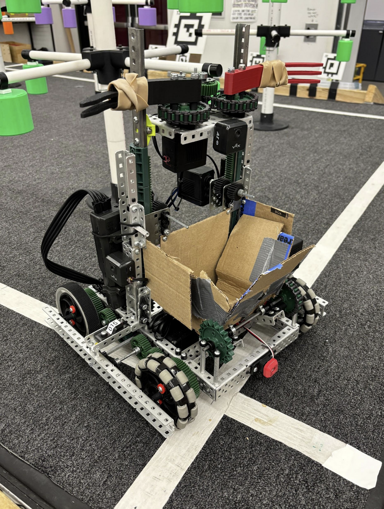
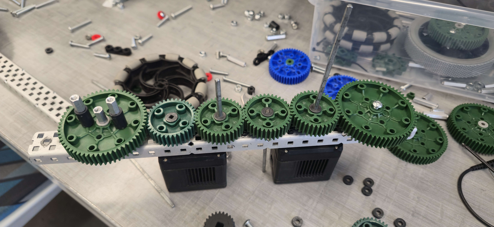
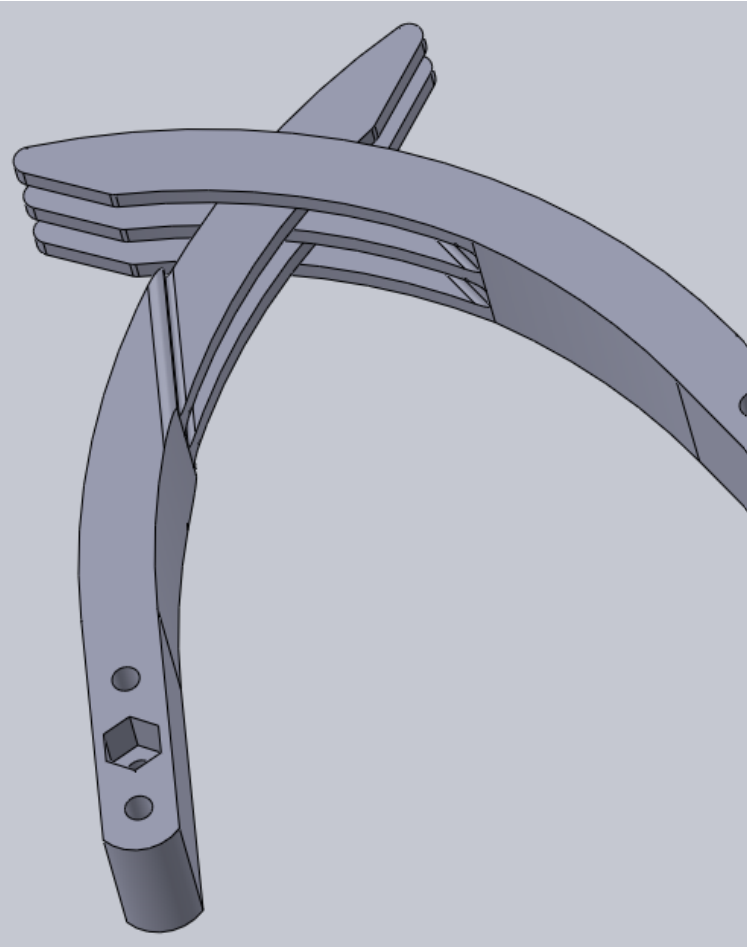
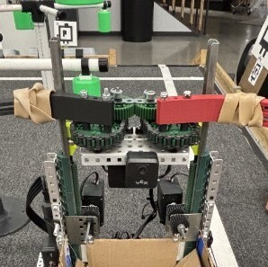
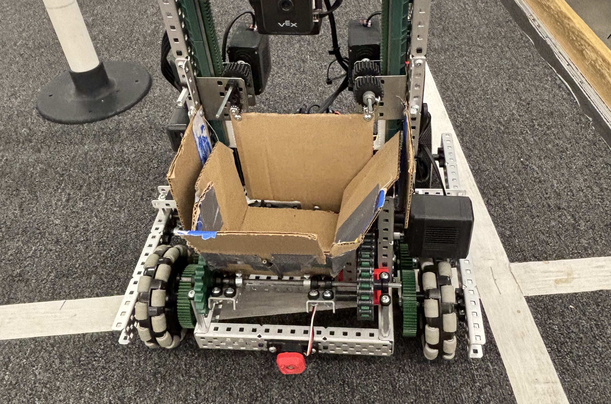
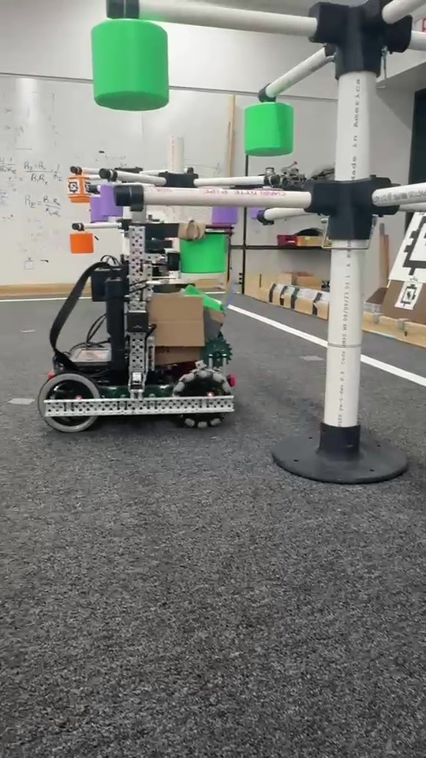

# Autonomous Fruit-Harvesting Robot

## Project Overview

This project was developed for RBE 1001 at Worcester Polytechnic Institute as a four-person team project. The goal was to design and build a robot capable of autonomously navigating an orchard-style field, locating fruit, harvesting it from multiple heights, transporting it across the field, and depositing it into the correct collection baskets.

The final robot combined a four-wheel drivetrain, an elevator-mounted grabber, a fruit-storage hopper, dual vision cameras, reflectance sensors, an inertial sensor, and bumper sensing.

My primary contribution was the robot's autonomous software and control system. I wrote the large majority of the final autonomous code, developed the state-machine architecture, and implemented custom PID controllers for driving, turning, and swing-turn motion.

**Course:** RBE 1001 – Introduction to Robotics  
**Institution:** Worcester Polytechnic Institute  
**Project Dates:** March 2026 – May 2026



*Final fruit-harvesting robot.*

---

## Design Goals

The robot was designed around several major requirements:

- Navigate the field autonomously
- Detect and approach fruit using vision
- Harvest fruit from multiple heights
- Store multiple pieces of fruit before delivery
- Identify and navigate toward the correct drop-off location
- Follow field markings and avoid obstacles
- Climb the field ramp reliably
- Perform the full harvest-and-delivery cycle autonomously

Meeting these requirements required close integration between the mechanical design, sensors, controls, and autonomous software.

---

## Mechanical System

The robot evolved substantially throughout the project.

### Drivetrain

The original drivetrain was replaced with a four-wheel-drive configuration using traction wheels in the rear and omni wheels in the front. The additional motors increased stability and reduced unwanted drift while retaining the ability to turn effectively.

The drivetrain also used screw-joint-mounted drive components in several locations to reduce friction and improve mechanical reliability.



### Fruit Grabber

The end effector used two interlocking claws designed to close around fruit of different sizes.

The original claw mechanism relied heavily on gears, but repeated gear skipping caused reliability problems. The team redesigned the mechanism around sprockets and chain while retaining gears to synchronize the two sides.



### Elevator

An elevator allowed the grabber to reach fruit at multiple heights.

The mechanism eventually used two motors driving rack-and-pinion systems. Mechanical stops were also added to prevent the elevator from overextending and damaging itself.



### Hopper

A lightweight hopper was added after testing revealed that carrying fruit in the grabber obstructed one of the cameras.

The hopper allowed the robot to store multiple pieces of fruit before reaching the drop-off location. A motorized pivoting floor allowed the robot to deposit the stored fruit into a basket.



---

## Autonomous Software Architecture

The final program was structured as a **12-state finite state machine** that coordinated navigation, sensing, fruit collection, wall detection, line following, and deposition.

The robot transitioned between states based on sensor input and completion of autonomous actions rather than running one long sequence of blocking commands.

Some of the major behaviors included:

- Driving up the starting ramp
- Aligning with the first tree
- Searching for visible fruit
- Vision-assisted navigation toward fruit
- Harvesting fruit
- Navigating around tree branches
- Locating the field perimeter
- Detecting contact with a wall
- Finding and following field lines
- Identifying drop-off baskets using AprilTags
- Depositing collected fruit
- Resetting for another harvesting cycle

## Autonomous State Transition Diagram

```mermaid
flowchart TD
    flowchart TD
    A[Start / IDLE] --> B[RAMP_DRIVE]
    B --> C[SEARCHING]
    C --> D[APPROACHING]
    D --> E[HARVESTING]
    E --> F[FRUIT_NAVIGATION]

    F --> G{More Fruit to Collect?}

    G -- Yes --> H[Reposition Around Tree]
    H --> C

    G -- No --> I[AVOID_DANGER]
    I --> J[FIND_WALL]
    J --> K[FIND_LINE]
    K --> L[DELIVERING]
    L --> M[DEPOSIT_RESET]
    M --> C

    classDef process fill:#f8f9fa,stroke:#333,stroke-width:1.5px,color:#111;
    classDef decision fill:#fff4cc,stroke:#333,stroke-width:1.5px,color:#111;

    class A,B,C,D,E,F,H,I,J,K,L,M process;
    class G decision;
```

---

## PID Motion Control

I developed three custom PID-based motion-control classes for:

- Straight-line driving
- In-place turning
- Swing turns

The drive controller used average motor-encoder position as its primary feedback source. Turning incorporated inertial-sensor feedback and absolute rotation to improve angular accuracy.

The swing-turn controller allowed the robot to pivot around one side of the drivetrain, which was particularly useful when maneuvering around trees and branches where conventional point turns were difficult.

The drive and swing controllers could also use vision feedback to adjust heading toward detected fruit while the robot was moving.

This project was my first time developing a reusable PID control architecture rather than relying primarily on pre-existing robotics libraries.

---

## Sensor Integration

The autonomous system integrated several different sensors:

### Vision Cameras

Two AI vision cameras served different purposes.

One camera was mounted near the fruit-handling system and used to locate fruit and assist with alignment during harvesting.

The second camera was used primarily for detecting AprilTags placed around the field and near the drop-off baskets.

### Inertial Sensor

The inertial sensor provided angular feedback for PID-based turning and improved the consistency of autonomous rotations.

### Reflectance Sensors

Reflectance sensors were used to detect and follow field lines.

The line-following behavior used proportional-derivative heading correction to keep the robot centered on the line.

### Bumper Sensor

A front-mounted bumper provided a reliable physical reference when the robot reached a wall or collection basket.

Rather than relying entirely on estimated position, the robot could deliberately drive until the bumper was pressed and use that event to establish a known physical location.

---

## Autonomous Navigation

One of the more difficult navigation challenges was moving between fruit around the trees.

The elevator extended high enough that branches could interfere with the robot. Since the software did not yet support continuous curved trajectories, I developed a sequence that combined turns, short drives, and swing turns to approximate a curved path around the tree.

This worked reliably in isolation, although accumulated alignment error reduced accuracy when incorporated into the complete autonomous routine.

After collecting fruit, the robot used vision to locate a large AprilTag near the field boundary, drove toward the wall until the bumper activated, and then searched for the field line.

The robot followed the line toward the appropriate drop-off basket, where vision identified the relevant AprilTag before the robot aligned with the basket and deposited its fruit.

---

## Testing and Results

By the end of the project, the robot was capable of autonomously:

- Navigating the competition field
- Detecting and approaching fruit
- Harvesting fruit
- Navigating between field features
- Following lines
- Identifying drop-off locations
- Depositing collected fruit

The autonomous system was not perfectly consistent. Alignment errors occasionally caused the robot to miss fruit, and the tall elevator could interfere with tree branches.

However, the final robot could consistently complete meaningful portions of the autonomous harvesting-and-delivery cycle and demonstrated successful integration of perception, feedback control, and state-based autonomous behavior.



*Robot with two collected fruit collecting one more on the final RBE 1001 field.*

---

## Challenges and Iteration

Several aspects of the project required substantial iteration.

### Blocking Code to State Machine

Early autonomous routines used more sequential, blocking control logic. As the robot became more complex, this architecture became difficult to manage.

The final software transitioned to a state-machine architecture, allowing sensor readings and autonomous behaviors to be coordinated more cleanly.

### PID Timing

As the state machine grew, execution time between control-loop updates became less consistent. This affected the timing of PID updates and demonstrated why deterministic control-loop timing matters in robotics software.

### Mechanical Constraints

Several software problems were ultimately caused by mechanical constraints rather than purely programming issues.

For example, autonomous alignment could be correct while the tall elevator still collided with tree branches. This reinforced the importance of considering mechanical geometry when designing autonomous behavior.

---

## Future Improvements

If I continued developing the robot, several software improvements would be priorities.

### Odometry

Adding dedicated tracking wheels and rotation sensors would allow the robot to continuously estimate its X/Y position on the field.

This would enable more advanced autonomous navigation techniques such as:

- Point-to-point motion
- Heading-controlled trajectories
- Cubic spline paths
- Pure pursuit

### Improved Swing Control

The existing swing behavior primarily approximated a pivot using one powered side of the drivetrain.

A dedicated swing-to-angle controller would provide more repeatable curved motion around obstacles and trees.

### Deterministic Control Loops

Separating motion-control loops into consistently timed execution threads would reduce variation in PID update timing and make autonomous behavior more predictable.

---

## My Contributions

- Architected the 12-state autonomous control system
- Developed custom PID controllers for driving, turning, and swing turns
- Integrated encoder, IMU, vision, reflectance, and bumper feedback
- Implemented vision-assisted navigation and line following
- Developed navigation behavior for harvesting and delivery
- Assisted with drivetrain concepts, system testing, and autonomous tuning

The project significantly improved my understanding of PID control, finite-state machines, autonomous robotics, sensor integration, and the interaction between software and mechanical design.

---

## Source Code

The original project source code is available here:

[View the RBE 1001 robot code](https://github.com/cjhickson647/billy-rbe1001/src/autonomous_controller.py)

The final autonomous program is primarily contained in:

`src/autonomous_controller.py`

---

## Engineering Takeaways

This project was one of my first experiences developing autonomous software for a robot whose behavior depended on many interconnected mechanical and electrical systems.

The biggest lesson was that autonomous robotics is rarely a purely software problem. A navigation routine can behave exactly as programmed and still fail because of wheel slip, mechanical interference, sensor placement, electrical reliability, or differences between the assumed and actual geometry of the robot.

Developing the state machine also changed how I approached autonomous software. Earlier routines relied heavily on sequential commands and blocking control loops. As the system grew, I learned the value of separating behaviors into explicit states and designing transitions around sensor feedback.

Implementing PID control from the ground up also gave me a much stronger understanding of feedback control than simply tuning an existing controller. I had to reason about encoder measurements, inertial feedback, execution timing, stopping conditions, and how different motion types required different control strategies.

Most importantly, the project gave me experience integrating perception, controls, software architecture, and mechanical systems into one autonomous robot rather than treating them as separate problems.