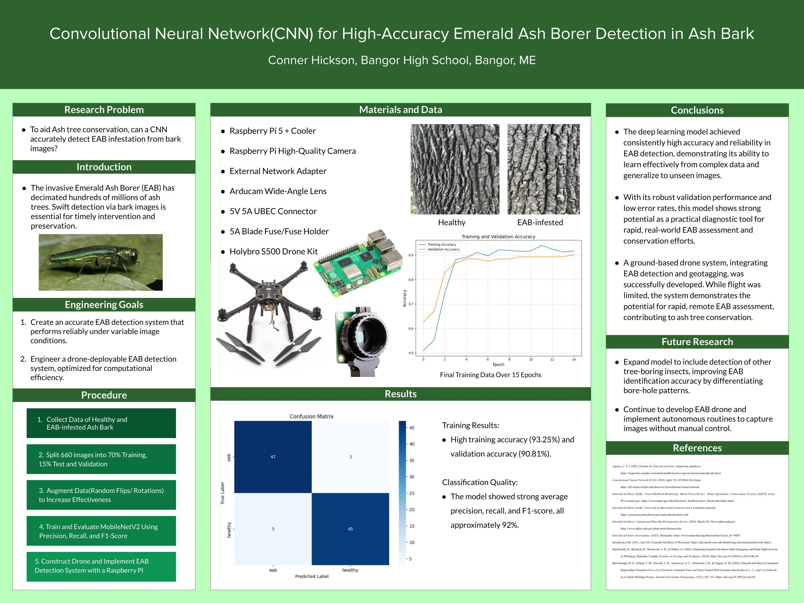
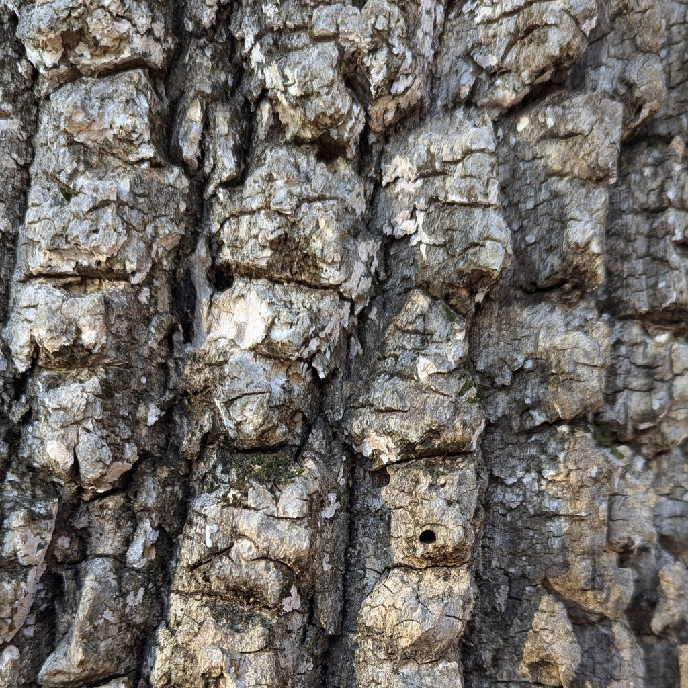
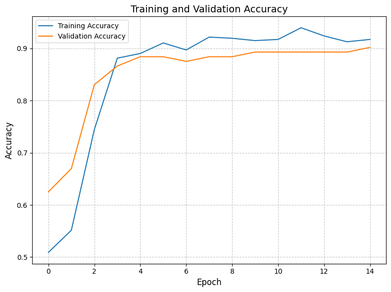
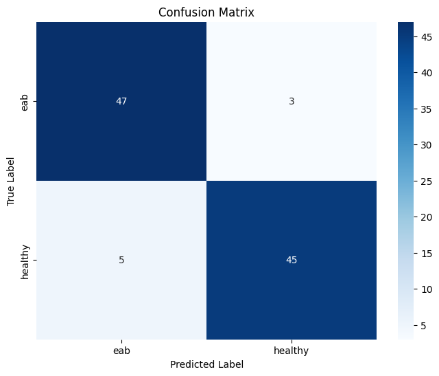
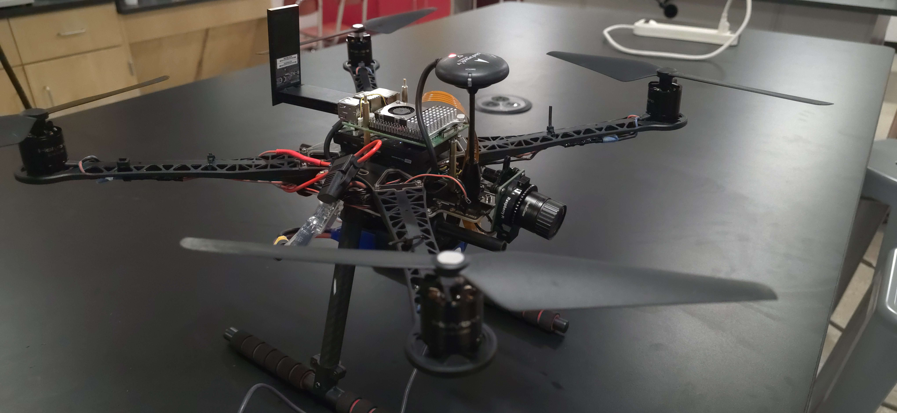
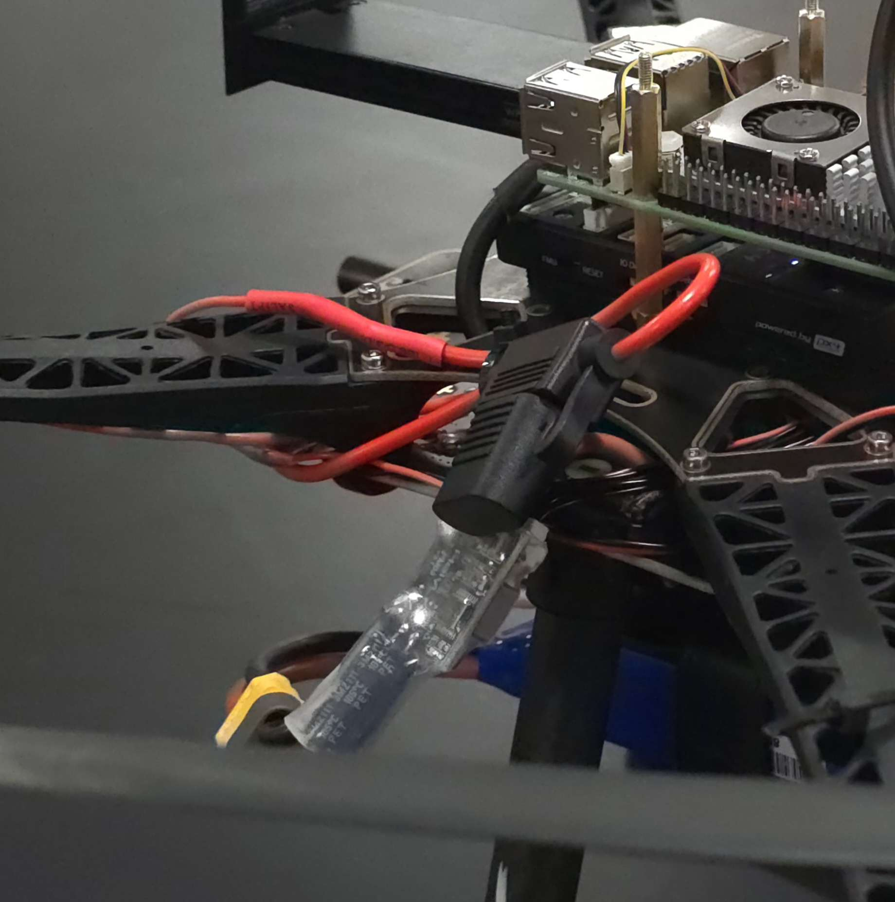
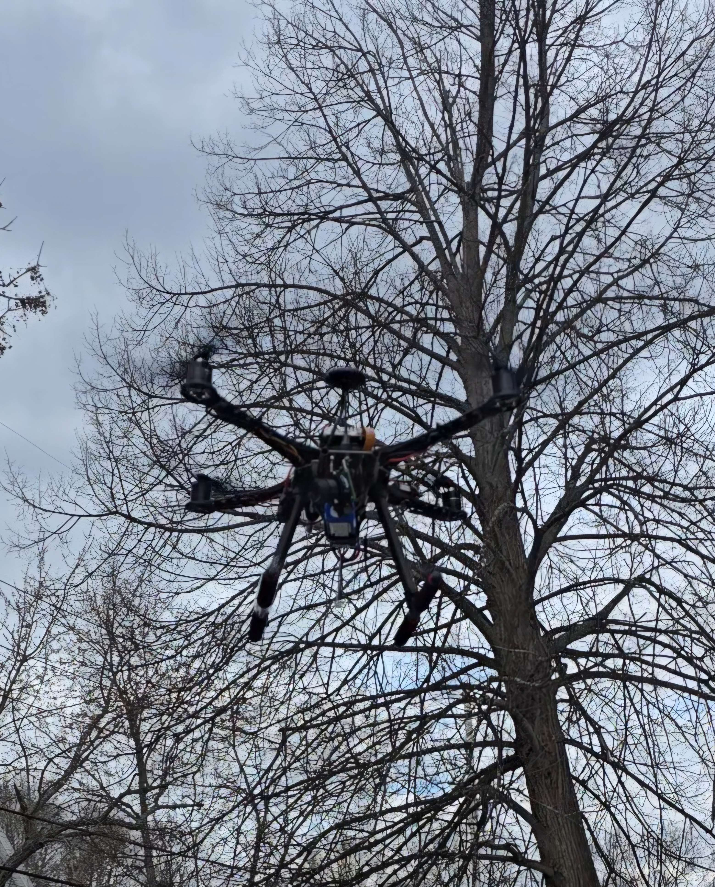
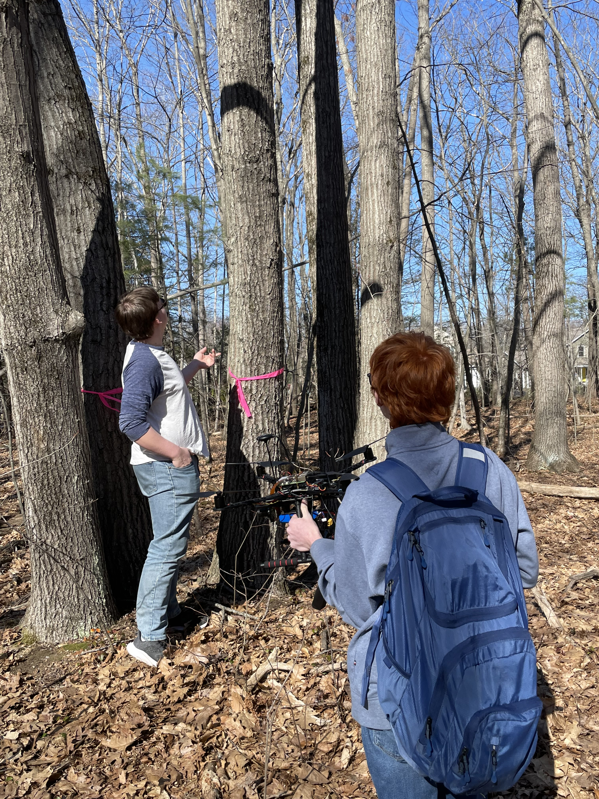

# Real-Time Emerald Ash Borer Detection Using Deep Learning

## Project Overview

Emerald Ash Borer (EAB), *Agrilus planipennis*, is an invasive insect responsible for widespread ash-tree mortality across North America. Early identification is important because intervention becomes increasingly difficult as infestations spread.

This project explored whether computer vision could provide a faster method of identifying potential EAB infestations from images of ash bark.

I developed and trained a transfer-learning image classifier using **MobileNetV2**, then deployed the trained model to a **Raspberry Pi 5** mounted on a drone prototype. The embedded system used a Pi HQ camera, TensorFlow Lite inference, a local Wi-Fi network, and a Flask interface to provide live imagery and classification results in the field.

The project eventually expanded beyond machine learning into embedded computing, networking, drone integration, power electronics, MAVLink communication, and field testing.

**Project Type:** Independent Science Fair / Research Project  
**Location:** Bangor, Maine  
**Project Dates:** December 2024 – April 2025  
**Presented At:** Maine State Science Fair

---

## Problem

Emerald Ash Borer infestations can be difficult to identify quickly from visual inspection alone.

Several signs can indicate EAB infestation, including:

- D-shaped exit holes
- Bark splitting
- Serpentine galleries
- Woodpecker activity and bark blonding
- Crown dieback

I chose **D-shaped exit holes in ash bark** as the primary visual feature for classification because they provide a relatively localized feature that could potentially be identified from close-range images.

The long-term goal was not just to train a classifier, but to determine whether the model could eventually become a practical field-survey tool.

---

## Dataset Development

Because no purpose-built EAB image dataset was available to me, I assembled my own dataset from public-domain and research sources.

The final dataset contained **660 images**:

- 330 EAB-infested bark images
- 330 healthy ash-bark images

Sources included iNaturalist, Forestry Images, and the BarkNet dataset.

I wrote a Python script using **scikit-learn** to split the dataset into:

- 70% training
- 15% validation
- 15% testing

Images were cropped to focus on bark and reduce unrelated visual features such as branches and background scenery.

---

## Image Preprocessing and Augmentation

The training pipeline used Keras `ImageDataGenerator` preprocessing.

Input images were resized to **224 × 224 pixels** and normalized before training.

To reduce overfitting and increase the effective variety of the limited dataset, I applied augmentation including:

- Random rotation
- Width and height shifts
- Shearing
- Zoom
- Horizontal flipping

These augmentations allowed the model to encounter varied versions of the available training images rather than repeatedly learning from identical inputs.

---

## Initial Model: EfficientNetB0

My first approach used **EfficientNetB0** with transfer learning.

The network was pretrained on ImageNet and modified with additional pooling, dense, dropout, and binary-classification layers.

I also implemented:

- Early stopping
- Dynamic learning-rate reduction
- Model checkpoints
- TensorBoard logging

Despite repeated tuning, EfficientNetB0 consistently struggled to converge and remained around 50–60% accuracy.

Rather than continuing to tune a model that was performing poorly on the relatively small dataset, I switched architectures.

---

## MobileNetV2

I replaced EfficientNetB0 with **MobileNetV2**, a lightweight convolutional neural network designed for efficient deployment on mobile and embedded hardware.

This architecture performed substantially better on the dataset.

The model used:

- ImageNet-pretrained MobileNetV2 base layers
- Global average pooling
- Dense classification layers
- Dropout regularization
- Adam optimization
- Binary cross-entropy loss
- Early stopping
- Dynamic learning-rate reduction

After training and fine-tuning, the network reached approximately:

- **93.25% training accuracy**
- **90.18% validation accuracy**

---

## Debugging the Training Process

One of the more important parts of the project was recognizing that good-looking metrics were not automatically trustworthy.

During earlier training runs, validation accuracy was consistently higher than training accuracy. I suspected either data leakage, accidental overfitting, or lingering model state from repeated experimentation.

I ultimately reset the model and training pipeline and retrained from scratch.

The resulting learning curves behaved much more reasonably, with training and validation performance converging above 90%.

This was an important lesson in validating the training process rather than simply accepting favorable results.

---

## Independent Test Evaluation

After training was complete, I evaluated the model on a separate **100-image test set**, containing:

- 50 EAB images
- 50 healthy images

The model correctly classified:

- 47/50 EAB images
- 45/50 healthy images

This resulted in approximately:

- **92% accuracy**
- **92% average precision**
- **92% average recall**
- **0.92 F1-score**

The test set provided a more meaningful estimate of performance than training or validation accuracy alone because it was not used during model development.

---

## Embedded Deployment

After training the model, I converted it for deployment using **TensorFlow Lite**.

The embedded system consisted of:

- Raspberry Pi 5
- Raspberry Pi HQ Camera
- TensorFlow Lite inference
- Pixhawk 4 flight controller
- External Wi-Fi adapter
- Flask web server
- Local offline wireless network

The Raspberry Pi captured images, ran classification locally, and displayed results through a browser-accessible interface.

---

## Web Interface and Local Network

I created a Flask-based interface that provided:

- Live camera streaming
- Captured-image display
- Classification result
- Classification confidence
- Manual image capture
- GPS information
- Image geotagging

The Raspberry Pi generated its own local Wi-Fi network using an external network adapter, allowing another device to access the interface without Internet connectivity.

This meant the system could operate independently in the field.

---

## Pixhawk and MAVLink Integration

The Raspberry Pi communicated with the **Pixhawk 4** flight controller using MAVLink.

The system could:

- Receive RC-channel data
- Trigger image classification from a controller input
- Retrieve GPS coordinates
- Record latitude, longitude, altitude, and timestamps
- Associate captured imagery with geographic location

This made it possible to connect image classification results with the location where the image was captured.

---

## Drone Power Integration

The Raspberry Pi 5 required a stable 5 V supply while the drone battery provided approximately 11.1 V.

I integrated a **UBEC** to step the battery voltage down to 5 V and added a 5 A blade fuse between the drone power-distribution board and Raspberry Pi power system.

This was also one of my first projects involving substantial soldering and electrical integration.

---

## Drone Integration and Flight Testing

Integrating the vision system with the drone became a substantial engineering challenge of its own.

Early flight tests revealed inconsistent motor behavior that caused the drone to spin, flip, or fail to take off.

I worked through several potential causes, including:

- Battery performance
- Added payload weight
- ESC and motor behavior
- Flight-controller calibration
- Frame and motor replacement
- Flight mode configuration

At one point I rebuilt the drone using another frame, motors, and ESCs in an attempt to isolate the problem.

The breakthrough came after replacing the flight controller. With the replacement controller installed, the drone finally flew successfully.

The system was later able to fly with the Raspberry Pi and camera payload installed.

---

## Position Hold and Survey Testing

After resolving the flight-control problems, I tested GPS-assisted position hold.

Once the GPS obtained a reliable lock, the drone was capable of maintaining a relatively stable position in the air, making it significantly more practical for photographing trees.

This allowed me to begin testing the system as an actual aerial survey platform rather than simply as a bench-mounted classifier.

---

## Field Testing

For the final field test, I traveled to Portland, Maine to locate ash trees using previously published EAB-location information.

Finding confirmed infected trees proved difficult because the available location information was outdated.

I ultimately located several white ash trees, but none showed confirmed EAB infestation.

I collected roughly **10 images per tree at multiple heights**.

The system classified all tested trees as healthy, with average confidence values ranging from approximately **84–89%**.

Because I was unable to locate confirmed infected trees, this field test could not independently validate EAB detection performance in real-world infected trees.

However, it demonstrated that the complete imaging, inference, networking, and field-deployment pipeline could operate outside the lab.

---

## Limitations

Although the model achieved strong performance on the curated test dataset, the project had several important limitations.

### Dataset Quality

The training data came from multiple public online sources rather than from a controlled field survey.

Differences in lighting, camera quality, image composition, and source distribution may allow a model to learn unintended correlations rather than only biological characteristics.

### Limited Dataset Size

A dataset of 660 images is relatively small for computer-vision training.

Transfer learning and augmentation helped compensate for this, but a larger and more standardized dataset would likely improve generalization.

### Binary Classification

The network only distinguished between:

- Healthy ash bark
- EAB-infested ash bark

Other boring insects can produce visually similar damage.

A stronger future model should include additional classes for other insects and bark defects.

### Field Validation

I was unable to locate confirmed EAB-infested trees during final drone testing.

As a result, the 92% test-set accuracy should not be interpreted as proven 92% accuracy under unrestricted field conditions.

---

## Future Improvements

If I continued the project, I would focus on:

- Collecting a larger field-generated dataset
- Testing on confirmed EAB-infested trees
- Adding other tree-boring insects as separate classes
- Improving autonomous drone navigation
- Automating image collection and survey routes
- Improving geotagged mapping of detection results
- Evaluating model performance across lighting, distance, and seasonal conditions

A more robust system could eventually combine aerial survey imagery with close-range bark classification to prioritize trees for further inspection.

---

## Research Paper and Lab Notebook

The formal research paper documents the machine-learning portion of the project in detail, while the project lab notebook contains the later embedded-system, drone, networking, and field-testing development.

[View the full research paper and engineering notebook](EAB-Lab-Notebook.pdf)

---

## My Contributions

This was an individual project.

I:

- Collected and organized the 660-image dataset
- Developed preprocessing and dataset-splitting tools
- Built the TensorFlow/Keras training environment
- Evaluated EfficientNetB0 and MobileNetV2
- Trained and fine-tuned the final MobileNetV2 classifier
- Developed the independent evaluation pipeline using scikit-learn
- Converted and deployed the model using TensorFlow Lite
- Developed the Raspberry Pi camera and classification system
- Built the Flask web interface and local Wi-Fi network
- Integrated Pixhawk/MAVLink communication and GPS geotagging
- Integrated the Raspberry Pi power system with the drone
- Rebuilt and troubleshot the drone through repeated flight testing
- Conducted final ash-tree field testing

---

## Engineering Takeaways

This project started as a machine-learning experiment but became a much broader systems-engineering project.

One of the biggest lessons was that strong model metrics do not automatically imply strong real-world performance. I had to investigate suspicious validation behavior, reset training after potential leakage or overfitting, and ultimately evaluate the final network on a separate test set.

The project also showed me the gap between developing a model on a computer and deploying it in a real system. Running inference on a Raspberry Pi required integrating cameras, networking, power electronics, flight-controller communication, GPS data, and a user interface.

The drone work reinforced the importance of systematic troubleshooting. Several early failures appeared to be software, calibration, battery, or motor problems, but replacing the flight controller ultimately resolved the primary flight issue. Rebuilding and testing the system piece-by-piece taught me to isolate variables rather than repeatedly changing multiple things at once.

Most importantly, the project taught me to distinguish between **successful prototype validation** and **proven field performance**. The classifier performed well on the curated dataset, and the deployed system worked in field conditions, but testing on confirmed infected trees would still be necessary before claiming reliable real-world detection.